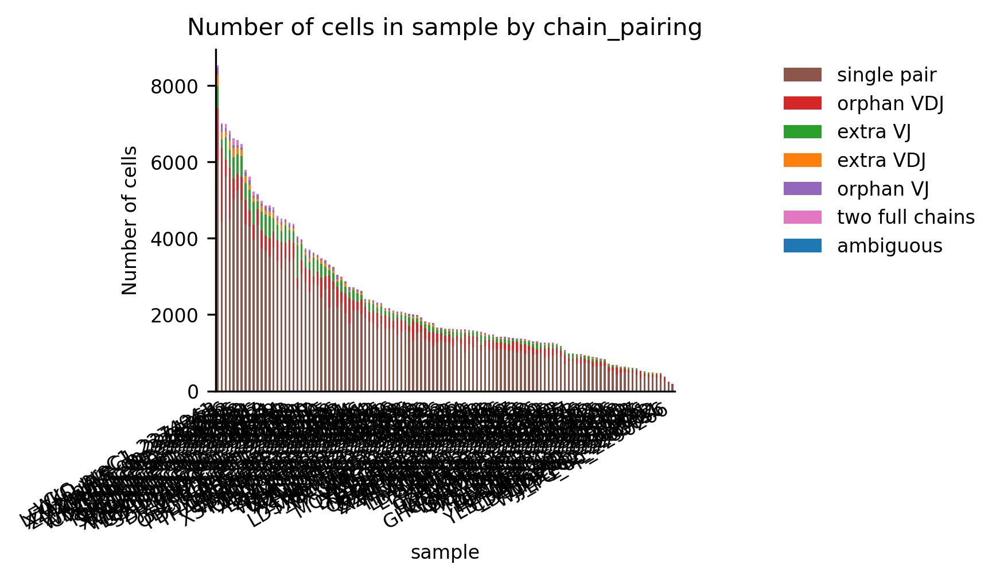
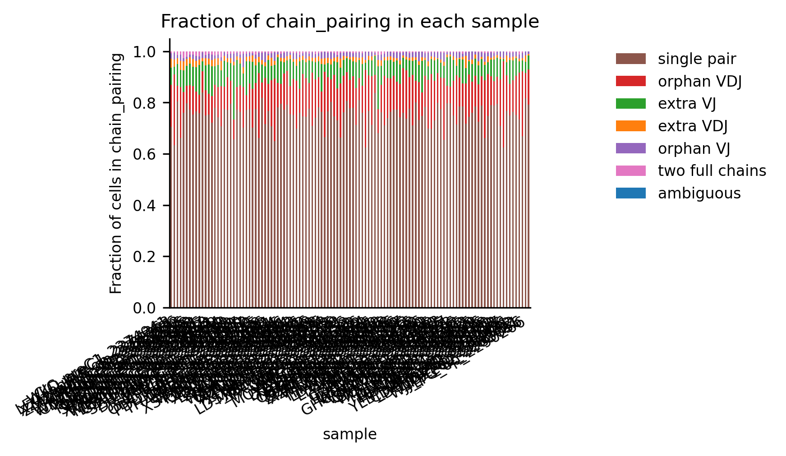

# TCR数据质控和预处理         (What)

* Dec 11, 2025                                 (When)
* liyi /data1/liyi/zhaoyue/FUSCC-ESCC-neoadjuvant_thrapy           (Where)
* 查看TCR数据的大致情况，定义clonotype (Why)

### 导入模块
```python
import warnings
warnings.filterwarnings(    
"ignore",    
".*IProgress not found*",
)
warnings.simplefilter(action="ignore", category=FutureWarning)
import pandas as pd
import scanpy as sc
import scirpy as ir
import os
import muon as mu
import matplotlib.pyplot as plt
warnings.simplefilter(action="ignore", category=pd.errors.DtypeWarning)
```

### 把所有样本整合起来(去除7个不要的)
```python
data_root = "input/ALL_TCR/ALL_TCR"
samples = []
for sample_id in os.listdir(data_root):
    # 样本文件夹的完整路径
    sample_dir = os.path.join(data_root, sample_id)
    # 指定tcr路径
    tcr_fname = "filtered_contig_annotations.csv"
    tcr_path = os.path.join(sample_dir,tcr_fname)
    # 构建样本信息字典
    sample_info = {
                "sample_id": sample_id,
                "tcr_path" : tcr_path,
            }
    # 添加到样本列表
    samples.append(sample_info)
adatas = {}
for sample_dict in samples:
        try:
            sample_id = sample_dict['sample_id']
            tcr_path = sample_dict['tcr_path']
            sample_adata = ir.io.read_10x_vdj(tcr_path)
            sample_adata.obs['sample'] = sample_id
            adatas[sample_id] = sample_adata
            print(f"已读取样本: {sample_id}")
        except Exception as e:
            print(f"读取样本 {sample_id} 失败: {str(e)}")

## 合并
adata_tcr = sc.concat(adatas,label="sample",join="outer")
## 确保细胞名唯一
adata_tcr.obs_names_make_unique()
samples_exclude=[
  'LCR_preC1_2265065',
  'SCH_preC1_2265089',
  'RWX_preC1_2265611',
  'ZJK_preC1_2266252',
  'WFC_preC1_2268478',
  'YDY_preC1_2271160',
  'SZR_op_2279307'
]
adata_tcr=adata_tcr[~adata_tcr.obs['sample'].isin(samples_exclude)]
```

### 计算质控参数
```python
ir.pp.index_chains(adata_tcr)
ir.tl.chain_qc(adata_tcr)
```

### 绘制简单的质控图片
```python
_ = ir.pl.group_abundance(adata_tcr, groupby="sample", target_col="chain_pairing",max_cols=0)
plt.savefig(
    "plots/chain_pairing.png",  # 保存路径+文件名
    dpi=300,  # 分辨率（建议300+）
    bbox_inches="tight"  # 自动裁剪空白边距（避免标签被截断）
)
plt.close()
_ = ir.pl.group_abundance(adata_tcr, groupby="sample", target_col="chain_pairing", normalize=True,max_cols=0)
plt.savefig(
    "plots/chain_pairing_normalize.png",  # 保存路径+文件名
    dpi=300,  # 分辨率（建议300+）
    bbox_inches="tight"  # 自动裁剪空白边距（避免标签被截断）
)
plt.close()

```


从第二张图可以看出来single pair占比都是超过60%,质量都是不错滴

### 计算clonotype
```python
ir.pp.ir_dist(adata_tcr,sequence="aa")
ir.tl.define_clonotypes(
    adata_tcr, receptor_arms="all", dual_ir="primary_only",
)
```

### 看下最大的一些clone
```python
ir.tl.clonotype_network(adata_tcr, min_cells=50, sequence="aa")
_ = ir.pl.clonotype_network(
    adata_tcr,
    color="sample",
    base_size=10,
    label_fontsize=9,
    panel_size=(10, 10),
    legend_fontsize=15,
)
plt.savefig(
    "plots/clones.png",  # 保存路径+文件名
    dpi=300,  # 分辨率（建议300+）
    bbox_inches="tight"  # 自动裁剪空白边距（避免标签被截断）
)
plt.close()
```

这个图哈哈哈,看来有好多很大的T细胞亚群


### 保存
```python
mdata=mu.MuData({"gex": adata_gex, "airr": adata_tcr})
adata_tcr.write("RData/TCR_merge_1216.h5ad")
```


### 导出用于R语言分析的数据框
#### clone信息数据框
```python
adata_tcr = sc.read("RData/TCR_merge_1216.h5ad")
df=adata_tcr.obs[["sample",'clone_id','clone_id_size','chain_pairing']].copy()
df['cell_id'] = df.index
df.to_csv('output/df_cc_1216.tsv', sep='\t', index=False)
```
#### CXCL13表达数据框
```
t_clusters = [
    'c01_CD4_Tn_TCF7',
    'c02_CD4_Tcm_S1PR1',
    'c03_CD4_Tcm_ANXA1',
    'c04_CD4_Tem_NR4A1',
    'c05_CD4_Treg_FOXP3',
    'c06_CD4_TOX',
    'c07_CD8_Tem/Teff_TNFSF9',
    'c08_CD8_Tem/Teff_HSPA1B',
    'c09_CD8_Tem/Teff_GNLY',
    'c10_CD8_Teff_GZMK',
    'c11_CD8_Tex_CXCL13',
    'c12_CD8_Temra_FGFBP2',
    'c13_CD8_IL7R',
    'c14_Tprf_MKI67',
]
target_gene = "CXCL13"
output_path = "output/CXCL13_expression_t_clusters.csv"
mask= adata_gex.obs["minor_celltype"].isin(t_clusters)
adata_filtered= adata_gex[mask, :].copy()  # 筛选细胞（保留所有基因）
if hasattr(adata_filtered.X, "toarray"):
    cxcl13_expr = adata_filtered[:, target_gene].X.toarray().flatten()
else:
    cxcl13_expr = adata_filtered[:, target_gene].X.flatten()
df_expr = pd.DataFrame({
    "cell_id": adata_filtered.obs.index,  # 细胞索引转为cell_id列
    "minor_celltype": adata_filtered.obs["minor_celltype"].values,  
    f"{target_gene}_expression": cxcl13_expr  # 基因表达值列
})
# 处理可能的NaN值（如表达值为空）
expr_col = f"{target_gene}_expression"
df_expr[expr_col] = df_expr[expr_col].fillna(0.0)

df_expr.to_csv(output_path,sep="\t",index=False,header=True,encoding="utf-8")

```


### 把转录组数据和TCR数据整合到一起
### 要注意这里其实是错的(这样会导致TCR数据和转录组数据实际上对不上-A样本测到的T细胞的细胞id会匹配到B样本的相同细胞id上去)
### 但那些图其实是对的，因为图只反映了TCR数据


# ！！！！！！！！！！！！！！！！！！！错误！！！！！！！！！！！！

```python
# Load the TCR data
adata_tcr = sc.read("RData/TCR_merge_1216.h5ad")

# Load the associated transcriptomics data
adata_gex = sc.read("RData/1128_final_escc120.h5ad")

mdata = mu.MuData({"gex": adata_gex, "airr": adata_tcr})
```

### 看下TCR是否和CD3数据重合
```python
fig, (ax0, ax1) = plt.subplots(1, 2, figsize=(10, 4), gridspec_kw={"wspace": 0.5})
mu.pl.embedding(mdata, basis="gex:umap", color=["CD3E"], ax=ax0, show=False)
mu.pl.embedding(mdata, basis="gex:umap", color=["airr:receptor_type"], ax=ax1,show=False)
plt.savefig(
    "plots/TCR_umap.png",  # 保存路径+文件名
    dpi=300,               # 分辨率（越高越清晰）
    bbox_inches="tight",   # 自动裁剪空白边距
    facecolor="white"      # 背景色（默认透明，设为白色更易查看）
)
plt.close()
```
确实是重合的，莫问题,但有个不小的问题是不是T细胞也有很多测出来有TCR..


### 画几张scirpy示例的克隆分析图
```python
t_clusters = [ 'c01_CD4_Tn_TCF7',
  'c02_CD4_Tcm_S1PR1',
  'c03_CD4_Tcm_ANXA1',
  'c04_CD4_Tem_NR4A1',
  'c05_CD4_Treg_FOXP3',
  'c06_CD4_TOX',
  'c07_CD8_Tem/Teff_TNFSF9',
  'c08_CD8_Tem/Teff_HSPA1B',
  'c09_CD8_Tem/Teff_GNLY',
  'c10_CD8_Teff_GZMK',
  'c11_CD8_Tex_CXCL13',
  'c12_CD8_Temra_FGFBP2',
  'c13_CD8_IL7R',
  'c14_Tprf_MKI67',]
mdata = mdata[mdata.obs['gex:minor_celltype'].isin(t_clusters)].copy()
### clonal expansion umap
# using default parameters, `ir_dist` will compute nucleotide sequence identity
ir.pp.ir_dist(mdata,sequence="aa")
ir.tl.define_clonotype_clusters(mdata, receptor_arms="all",sequence="aa", dual_ir="primary_only")

ir.tl.clonal_expansion(mdata,target_col="cc_aa_identity")
mu.pl.embedding(mdata, basis="gex:umap", color=["airr:clonal_expansion","airr:cc_aa_identity_size"],show=False)
plt.savefig(
    "plots/Clonal_expansion_umap.png",  # 保存路径+文件名
    dpi=300,               # 分辨率（越高越清晰）
    bbox_inches="tight",   # 自动裁剪空白边距
    facecolor="white"      # 背景色（默认透明，设为白色更易查看）
)
plt.close()

### clonal expansion barplot
_ = ir.pl.clonal_expansion(mdata, target_col="cc_aa_identity", groupby="gex:minor_celltype", breakpoints=(1, 2, 5), normalize=False)
plt.savefig(
    "plots/Clonal_expansion_barplot.png",  # 保存路径+文件名
    dpi=300,               # 分辨率（越高越清晰）
    bbox_inches="tight",   # 自动裁剪空白边距
    facecolor="white"      # 背景色（默认透明，设为白色更易查看）
)
plt.close()

_ = ir.pl.clonal_expansion(mdata, target_col="cc_aa_identity", groupby="gex:minor_celltype", breakpoints=(1, 2, 5), normalize=True)
plt.savefig(
    "plots/Clonal_expansion_barplot_normalized.png",  # 保存路径+文件名
    dpi=300,               # 分辨率（越高越清晰）
    bbox_inches="tight",   # 自动裁剪空白边距
    facecolor="white"      # 背景色（默认透明，设为白色更易查看）
)
plt.close()

### clonal diversity
_ = ir.pl.alpha_diversity(mdata, target_col="cc_aa_identity",metric="normalized_shannon_entropy", groupby="gex:minor_celltype")
plt.savefig(
    "plots/Clonal_diversity.png",  # 保存路径+文件名
    dpi=300,               # 分辨率（越高越清晰）
    bbox_inches="tight",   # 自动裁剪空白边距
    facecolor="white"      # 背景色（默认透明，设为白色更易查看）
)
plt.close()

### clonal abundance
_ = ir.pl.group_abundance(mdata, groupby="airr:cc_aa_identity", target_col="gex:minor_celltype", max_cols=10)
plt.savefig(
    "plots/clonal_abundance.png",  # 保存路径+文件名
    dpi=300,               # 分辨率（越高越清晰）
    bbox_inches="tight",   # 自动裁剪空白边距
    facecolor="white"      # 背景色（默认透明，设为白色更易查看）
)
plt.close()
_ = ir.pl.group_abundance(
    mdata,
    groupby="airr:cc_aa_identity",
    target_col="gex:minor_celltype",
    max_cols=10,
    normalize="gex:sample",
)
plt.savefig(
    "plots/clonal_abundance_normalize.png",  # 保存路径+文件名
    dpi=300,               # 分辨率（越高越清晰）
    bbox_inches="tight",   # 自动裁剪空白边距
    facecolor="white"      # 背景色（默认透明，设为白色更易查看）
)
plt.close()
mdata['gex'].obs['sample_site'] = mdata['gex'].obs['sample'].apply(lambda x: 'blood' if 'pbmc' in x.lower() else 'tumor')
mdata.update()
_ = ir.pl.group_abundance(mdata, groupby="airr:cc_aa_identity", target_col="gex:sample_site", max_cols=15, figsize=(5, 3))
plt.savefig(
    "plots/clonal_abundance_samplesite.png",  # 保存路径+文件名
    dpi=300,               # 分辨率（越高越清晰）
    bbox_inches="tight",   # 自动裁剪空白边距
    facecolor="white"      # 背景色（默认透明，设为白色更易查看）
)
plt.close()
mdata['gex'].obs['patient'] = mdata['gex'].obs['sample'].apply(lambda x: '_'.join([x.split('_')[0], x.split('_')[-1]]))
mdata.update()
_ = ir.pl.group_abundance(
    mdata,
    groupby="airr:cc_aa_identity",
    target_col="gex:patient",
    max_cols=15,
    figsize=(5, 3),
)
plt.savefig(
    "plots/clonal_abundance_patient.png",  # 保存路径+文件名
    dpi=300,               # 分辨率（越高越清晰）
    bbox_inches="tight",   # 自动裁剪空白边距
    facecolor="white"      # 背景色（默认透明，设为白色更易查看）
)
plt.close()
```


### 导出用于R分析的数据框(包括注释,包括TCR,包括metadata)
```python
mask = mdata.obs["gex:minor_celltype"].notna()
obs_filtered = mdata.obs[mask].copy()

for col in ["gex:major_celltype", "gex:TILC_celltype", "gex:myeloid_celltype"]:
    if col in obs_filtered.columns:
        obs_filtered[col] = obs_filtered[col].astype(str)

# 1. 生成middle_celltype并提取需要的列
obs_filtered["gex:middle_celltype"] = obs_filtered["gex:major_celltype"].copy()
obs_filtered.loc[obs_filtered["gex:major_celltype"] == "T&ILC cell", "gex:middle_celltype"] = obs_filtered["gex:TILC_celltype"]
obs_filtered.loc[obs_filtered["gex:major_celltype"] == "Myeloid cell", "gex:middle_celltype"] = obs_filtered["gex:myeloid_celltype"]

df = obs_filtered[['gex:major_celltype','gex:middle_celltype', 'gex:minor_celltype', 'gex:sample','airr:cc_aa_identity']].copy()
df['major_celltype'] = df['gex:major_celltype'].copy()
df['middle_celltype'] = df['gex:middle_celltype'].copy()
df['minor_celltype'] = df['gex:minor_celltype'].copy()


# 2. 添加细胞ID（行索引即为cell_id）
df['cell_id'] = df.index

# 3. 添加UMAP坐标（假设存储在obsm['X_umap']中）
df[['umap1', 'umap2']] = mdata["gex"].obsm['X_umap']
df['minor_umap1'] = obs_filtered['gex:minor_UMAP1']
df['minor_umap2'] = obs_filtered['gex:minor_UMAP2']

# 4. 处理anatomic_site：sample含pbmc则为blood，否则为tumor
df['sample'] = df['gex:sample'].copy()
df['anatomic_site'] = df['sample'].apply(lambda x: 'blood' if 'pbmc' in x.lower() else 'tumor')

# 5. 处理treatment_stage：根据sample中的关键词判断
def get_treatment_stage(sample):
    sample_lower = sample.lower()  # 统一转为小写，避免大小写问题
    if 'prec1' in sample_lower:
        return 'pre'
    elif 'prec2' in sample_lower:
        return 'on'
    elif 'op' in sample_lower:
        return 'post'
    else:
        return 'unknown'  # 处理未匹配到的情况

df['treatment_stage'] = df['sample'].apply(get_treatment_stage)

# 6. 处理patient：sample中以"_"分隔的第一项加最后一项
df['patient'] = df['sample'].apply(lambda x: '_'.join([x.split('_')[0], x.split('_')[-1]]))
# 有几个患者的住院号是不对的，要调整下
#PDD_2284071应该是PDD_2284017
#ZJM_2306458应该是ZJM_2306548
#YLY_2282682应该是YLY_2286282
replace_map = {
    'PDD_2284071': 'PDD_2284017',
    'ZJM_2306458': 'ZJM_2306548',
    'YLY_2282682': 'YLY_2286282'
}
df['patient'] = df['patient'].replace(replace_map)
df['patient_id'] = df['patient'].str.split('_').str[-1]

# 7 添加Patient_Number
unique_patients = df['patient'].unique()
patient_id_map = {pat: f"P{str(i+1).zfill(2)}" for i, pat in enumerate(unique_patients)}
df['patient_number'] = df['patient'].map(patient_id_map)

# 8 添加治疗信息
clin_df = pd.read_csv("input/clin_metadata.csv")
clin_df['patient_id'] = clin_df['patient_id'].astype(str).str.strip()
mpr_mapping = dict(zip(clin_df['patient_id'], clin_df['MPR']))
pcr_mapping = dict(zip(clin_df['patient_id'], clin_df['pCR']))
df['response_mpr'] = df['patient_id'].map(mpr_mapping)
df['response_pcr'] = df['patient_id'].map(pcr_mapping)

# 9 添加clone信息
df["clone.id"] = df["airr:cc_aa_identity"].copy()


# 10. 调整列顺序并命名
df = df[['cell_id', 'umap1', 'umap2','minor_umap1','minor_umap2','major_celltype',
        'middle_celltype','minor_celltype', 'anatomic_site', 'treatment_stage', 'patient','patient_id','patient_number','clone.id','response_mpr',
        'response_pcr']]

# 11. 保存为TSV文件
df.to_csv('output/错误df_1216.tsv', sep='\t', index=False)
```

# 查看结果（前5行）
print("提取的数据框前5行：")
print(df_extracted.head())
print(f"\n符合条件的细胞总数：{len(df_extracted)}")
